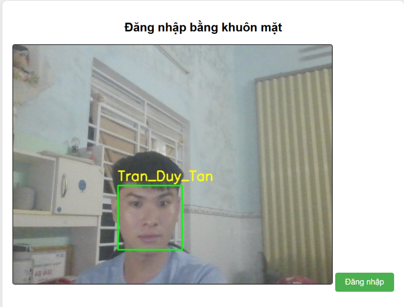

# Face Recognition Login

Ứng dụng web đăng nhập bằng **nhận diện khuôn mặt** theo thời gian thực, xây dựng với `Flask`, `OpenCV` và `face_recognition`. Hệ thống tự động học khuôn mặt từ thư mục ảnh, cache lại để tái sử dụng, và nhận diện qua webcam ngay trên trình duyệt.

---

## Tính năng

- **Stream webcam** trực tiếp lên giao diện web (MJPEG)
- **Vẽ bounding-box** kèm tên người lên video stream theo thời gian thực
- **Đăng nhập bằng khuôn mặt** — chụp frame từ webcam, so khớp và tạo session
- **Tự động huấn luyện** từ thư mục ảnh khi khởi động
- **Cache thông minh** — chỉ huấn luyện lại khi thư mục ảnh có thay đổi (so sánh SHA-256)
- **Bảo vệ route** `/welcome` bằng Flask session

---

## Cấu trúc dự án

```
face_recognizer/
├── app.py              # Khởi động app: train, webcam thread, Flask server
├── config.py           # Hằng số: threshold, đường dẫn, cấu hình Flask
├── face_trainer.py     # Hash thư mục, load ảnh, train, lưu/tải cache pickle
├── camera.py           # Thread đọc webcam, MJPEG generator, nhận diện overlay
├── routes.py           # Toàn bộ route Flask (index, login, video_feed, welcome)
├── training/           # Thư mục chứa ảnh huấn luyện (tạo thủ công)
│   ├── nguyen_van_a/
│   │   ├── anh1.jpg
│   │   └── anh2.jpg
│   └── tran_thi_b/
│       └── anh1.jpg
├── trained_data.pkl    # Cache encoding
└── templates/
    ├── index.html      # Trang chính: stream webcam + nút đăng nhập
    └── welcome.html    # Trang chào sau khi đăng nhập thành công
```

---

## Yêu cầu hệ thống

- Python 3.8+
- Webcam
- Windows / Linux / macOS

> **Lưu ý (Windows):** `face_recognition` yêu cầu `dlib`. Cài `cmake` và `Visual Studio Build Tools` trước khi `pip install dlib`.

---

## Cài đặt

```bash
# 1. Clone repo
git clone https://github.com/duytanst2004/face-recognizer.git
cd face-recognizer

# 2. Tạo môi trường ảo
python -m venv venv
venv\Scripts\activate          # Windows
# source venv/bin/activate     # Linux / macOS

# 3. Cài dependencies
pip install -r requirements.txt
```

---

## Chuẩn bị dữ liệu huấn luyện

Tạo thư mục `training/` với cấu trúc:

```
training/
└── <tên_người>/       ← tên thư mục = tên hiển thị khi nhận diện
    ├── anh1.jpg
    ├── anh2.jpg
    └── ...            ← càng nhiều góc chụp càng chính xác
```

**Lưu ý:**
- Mỗi ảnh chỉ nên chứa **một khuôn mặt**
- Ảnh rõ nét, đủ sáng, nhiều góc độ khác nhau
- Định dạng hỗ trợ: `.jpg`, `.jpeg`, `.png`

---

## Chạy ứng dụng

```bash
python app.py
```

Lần đầu chạy, hệ thống sẽ tự động huấn luyện từ thư mục `training/` và lưu cache vào `trained_data.pkl`. Các lần chạy sau sẽ tải cache ngay lập tức.

Mở trình duyệt tại: [http://localhost:5000](http://localhost:5000)

---

## Hướng dẫn sử dụng

1. Truy cập `http://localhost:5000`
2. Webcam sẽ tự bật, stream video hiển thị trên trang
3. Nhìn thẳng vào camera, nhấn nút **Đăng nhập**
4. Hệ thống chụp frame, so khớp khuôn mặt
5. Nếu nhận diện thành công → chuyển đến trang `/welcome`
6. Nếu thất bại → hiển thị thông báo lỗi

---

## Mô tả kỹ thuật

### Quy trình nhận diện

```
Ảnh từ webcam
    │
    ▼
Phát hiện vị trí khuôn mặt (face_locations)
    │
    ▼
Trích xuất face encoding (128-chiều)
    │
    ▼
So sánh khoảng cách Euclidean với known_encodings
    │
    ├─ distance < 0.4  →  Nhận diện thành công
    └─ distance ≥ 0.4  →  "Unknown"
```

### Cache thông minh

Khi khởi động, hệ thống tính SHA-256 của toàn bộ file trong `training/`. Nếu hash khớp với hash lưu trong `trained_data.pkl`, dữ liệu được tải từ cache thay vì huấn luyện lại — tiết kiệm đáng kể thời gian.

### Luồng webcam

Thread riêng biệt liên tục đọc frame từ webcam vào `Queue(maxsize=1)`, đảm bảo luôn có frame mới nhất mà không tốn bộ nhớ tích lũy.

---

## Thêm người dùng mới

1. Tạo thư mục `training/<tên_người>/`
2. Thêm ít nhất 3–5 ảnh khuôn mặt
3. Khởi động lại `python app.py` — hệ thống tự phát hiện thay đổi và huấn luyện lại

---

## Demo

### Trang đăng nhập


### Trang chào mừng
